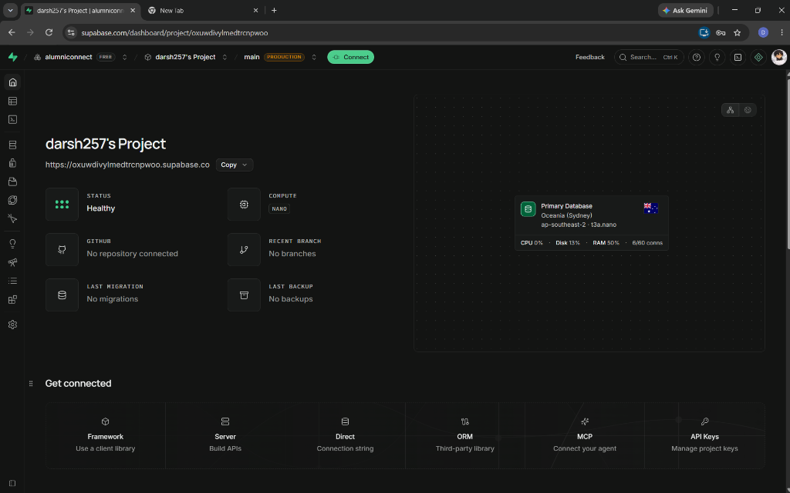

# AlumniConnect 🎓

A full-stack networking platform designed to bridge the gap between students and institutional alumni. Built to facilitate mentorship, networking, and career opportunities through a modern, responsive web application.

🌐 **[Live Demo: alumnibit.vercel.app](https://alumnibit.vercel.app/)**

## 📸 Screenshots
*(See the `/screenshots` folder for a visual walkthrough of the platform, or view the complete gallery on Google Drive!)*

👉 **[View All Screenshots on Google Drive](https://drive.google.com/drive/folders/18qNfEA5U79QIIJPs_xGC3wlKzgyjLZ8P?usp=sharing)**

### Login & Authentication


### Student Dashboard


## 🚀 Tech Stack

- **Frontend:** React 19, Vite, Tailwind CSS, Lucide Icons
- **Backend:** Node.js, Express, TypeScript
- **Database:** PostgreSQL (Hosted on Supabase)
- **Authentication:** JWT (JSON Web Tokens), bcrypt, Google OAuth2

## ✨ Key Features

- **Role-Based Access Control:** Distinct, tailored dashboards for Students, Alumni, and Administrators.
- **Secure Authentication:** Standard Email/Password login (bcrypt hashed) alongside Google Sign-In integration.
- **Modern UI/UX:** Clean, responsive interface styled with Tailwind CSS, utilizing glass-morphism and custom typography.
- **Mentorship & Networking:** Send, accept, and manage connection requests between students and verified alumni.
- **Opportunities Board:** Seamlessly post and discover job referrals and internships.

## 🛠️ Local Development Setup

### 1. Clone the repository
```bash
git clone https://github.com/darsh257/alumniconnect.git
cd alumniconnect
```

### 2. Frontend Setup
```bash
cd frontend
npm install
npm run dev
```
*(Runs on http://localhost:5173)*

### 3. Backend Setup
```bash
cd backend
npm install
```

Create a `.env` file in the `backend` directory with the following variables:
```env
PORT=5000
DATABASE_URL="your-supabase-postgres-connection-string"
JWT_SECRET="your-secret-key"
GOOGLE_CLIENT_ID="your-google-oauth-client-id"
```

Run the backend:
```bash
npm run dev
```
*(Runs on http://localhost:5000)*
